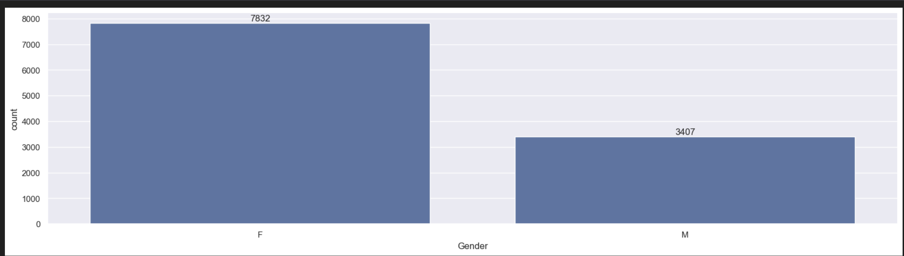
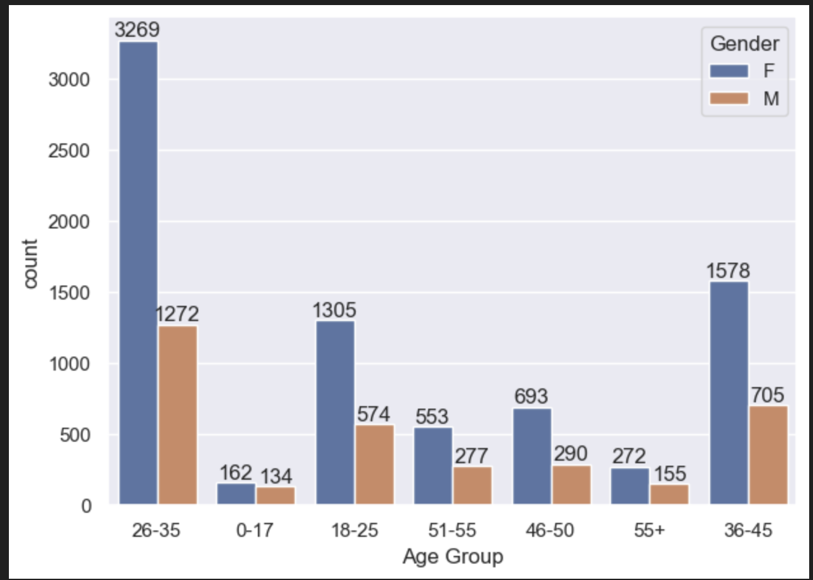
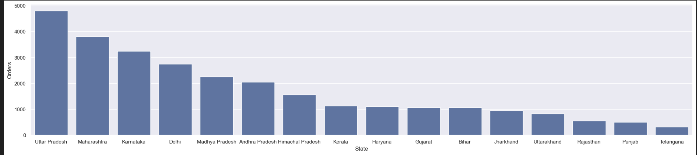
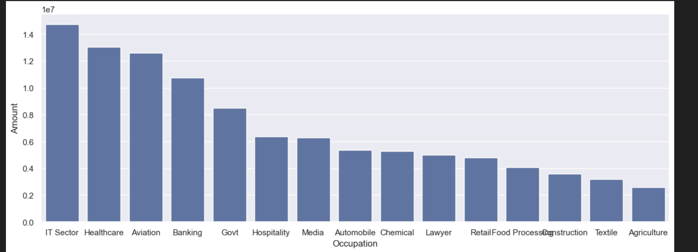
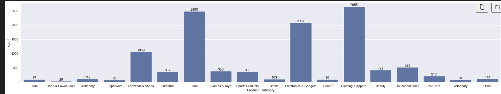

# 🪔 Diwali Sales Data Analysis

> A comprehensive Exploratory Data Analysis (EDA) project performed on a real-world festive sales dataset using Python.  
> This project transforms raw transactional data into strategic business intelligence by uncovering customer behavior, revenue drivers, and high-value market segments.

---

##  Executive Summary

The **Diwali Sales Data Analysis** project focuses on understanding customer purchasing patterns during a festive season sale.

Using Python-based data analytics tools, this project:

- Cleans and preprocesses raw sales data
- Performs in-depth exploratory data analysis (EDA)
- Identifies high-revenue customer segments
- Discovers top-performing product categories
- Extracts actionable business insights

This project demonstrates strong analytical thinking, data storytelling ability, and practical implementation of data science techniques.

---

# Business Problem Statement

Festive sales generate massive revenue for businesses. However, without proper data analysis, companies fail to:

- Identify their most valuable customers
- Optimize inventory
- Design targeted marketing campaigns
- Maximize profit margins

This project answers:

✔ Who are the highest spending customers?  
✔ Which age group contributes the most revenue?  
✔ Which states generate maximum sales?  
✔ Which product categories dominate revenue?  
✔ What demographic factors influence purchasing behavior?

---

# Dataset Description

**Dataset Name:** Diwali Sales Data  
**Files Included:**
- `diwali_sales.ipynb`
- `Diwali Sales Data.csv`

###  Dataset Features

| Column | Description |
|--------|------------|
| User_ID | Unique customer identifier |
| Gender | Male / Female |
| Age | Customer age group |
| Occupation | Profession category |
| State | Customer state |
| Marital_Status | Married / Unmarried |
| Product_Category | Product segment |
| Amount | Purchase amount |

---

#  Tech Stack

| Technology | Purpose |
|------------|----------|
| Python | Programming Language |
| Pandas | Data cleaning & manipulation |
| NumPy | Numerical computations |
| Matplotlib | Data visualization |
| Seaborn | Statistical visualization |
| Jupyter Notebook | Analysis environment |

---

# Project Workflow

```
Data Collection
        ↓
Data Cleaning
        ↓
Data Preprocessing
        ↓
Exploratory Data Analysis (EDA)
        ↓
Visualization
        ↓
Business Insights & Conclusions
```

---

#  Data Cleaning & Preprocessing

- Removed null values
- Dropped irrelevant columns
- Checked for duplicate records
- Converted data types where required
- Renamed columns for clarity
- Verified data consistency

This ensured accurate and reliable analysis.

---

# Exploratory Data Analysis (EDA)

---

 1️⃣ Gender-Based Purchase Analysis



### 🔎 Insight:
Female customers contribute significantly higher total revenue compared to male customers, indicating a strong target segment.

---

 2️⃣ Age Group vs Sales



### 🔎 Insight:
The 26–35 age group demonstrates the highest purchasing power, making it a key demographic for marketing campaigns.

---

 3️⃣ State-Wise Revenue Distribution



### 🔎 Insight:
Certain states dominate total sales volume, highlighting geographic concentration of revenue.

---

 4️⃣ Occupation-Based Spending Behavior



### 🔎 Insight:
IT, Healthcare, and Aviation professionals show strong and consistent purchasing behavior.

---

 5️⃣ Product Category Performance



###  Insight:
A limited number of product categories contribute to the majority of sales (Pareto Principle observed).

---

#  Key Business Insights

- Married women aged 26–35 form the highest revenue-generating segment.
- Working professionals in IT & Healthcare sectors contribute significantly to sales.
- Certain product categories dominate festive purchases.
- Revenue distribution is concentrated in specific high-performing states.
- Targeted marketing campaigns can significantly improve ROI.

---

#  Analytical Observations

- Clear demographic purchasing trends exist.
- Gender-based spending difference is statistically visible.
- Age group correlates with higher spending capacity.
- Urban state clusters contribute higher sales volume.

---

#  Screenshots Folder Structure

Create a folder named `screenshots` and add your generated visualizations:

```
Diwali-Sales-Analysis/
│
├── diwali_sales.ipynb
├── Diwali Sales Data.csv
├── README.md
└── screenshots/
    ├── gender-analysis.png
    ├── age-analysis.png
    ├── state-analysis.png
    ├── occupation-analysis.png
    └── product-category.png
```

---


 1️⃣ Clone Repository

```bash
git clone https://github.com/your-username/Diwali-Sales-Analysis.git
```

 2️⃣ Install Required Libraries

```bash
pip install pandas numpy matplotlib seaborn
```

 3️⃣ Run Notebook

```bash
jupyter notebook diwali_sales.ipynb
```

---

# Learning Outcomes

This project demonstrates:

- Strong data cleaning skills
- Practical implementation of EDA
- Business insight extraction from raw data
- Data visualization expertise
- Analytical problem-solving ability
- Real-world dataset handling

---

# Future Enhancements

- Predictive Sales Forecasting using Machine Learning
- Customer Segmentation using Clustering
- Revenue Prediction using Regression Models
- Interactive Dashboard using Streamlit
- BI Dashboard using Power BI / Tableau
- Deployment as Web App

---

# Why This Project Stands Out

- Real-world dataset
- End-to-end analysis workflow
- Strong business intelligence focus
- Clear and actionable insights
- Recruiter-friendly structure
- Industry-relevant use case

